## typecho-blog-theme-two-siderbar

基于 bootstrap 4 开发的 typecho 响应式两栏博客主题

## 一、主题说明

### 1、依赖

- `jquery 2.1.4`
- `bootstrap 4`
- `markdown.css`  ， 优化 markdown 内容显示，代码整合进了 `style.css`
- `normalize.css`, 代码整合进了 `style.css`
- `prism.js` 和 `prism.css`，优化代码高亮显示
- `popper.min.js`，bootstrap 4 依赖
- `jquery.goup.min.js`，返回顶部插件

### 2、更新记录

2018-07-15：

- 修复分页 `...` 显示问题

## 二、主题安装

> 主题安装方式与 其他 `typecho` 一样。

### 1、下载主题

下载主题文件：[https://github.com/postbird/typecho-blog-theme-two-siderbar/archive/master.zip](https://github.com/postbird/typecho-blog-theme-two-siderbar/archive/master.zip)

加压后上传到服务器 `typecho` 目录下 `/usr/themes/` 文件夹。

### 2、后台安装

登入 `typecho` 后台管理，选择 `控制台 -> 外观 `，启动 `Postbird-typecho-two-sidebar-block` 主题即可。

### 3、添加单独页面

#### 1）导航显示 `文章分类` 页面

创建独立页面，页面模板选择 `文章分类`，页面标题是导航中显示的文字

#### 2）导航显示 `归档`

创建独立页面，页面模板选择 `文章归档`，页面标题是导航中要显示的文字

#### 3）导航显示 `标签`

创建独立页面，页面模板选择 `标签模板`，页面标题是导航中要显示的文字

#### 4）导航显示 `友链`

创建独立页面，页面模板选择 `友情链接模板`，页面标题是导航中要显示的问题

`友链` 不同于上面三个独立页面，页面内容需要自己编辑，并最终显示，方便添加其他网站的链接。

如下图所示：

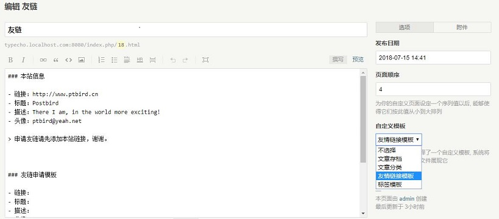

#### 5）导航显示 `关于`

`关于` 是选择默认模板，系统默认存在的页面。

#### 6）其他单独页面

其他的单独页面会直接在导航中显示，添加单独页面的时候，直接选择默认模板即可。

## 四、文件结构

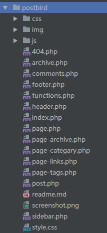

> `img/examples` 下的图片均为效果图片，无实际作用。

## 五、效果

### 1、PC端：

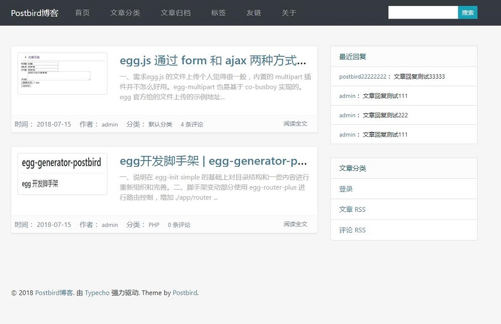

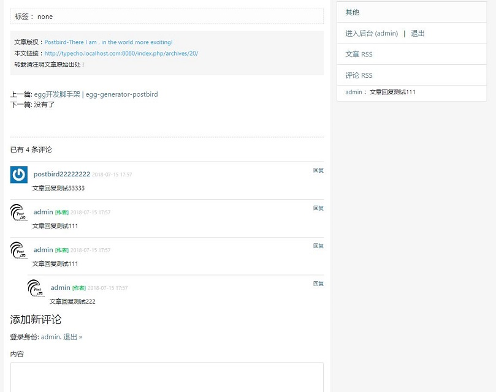

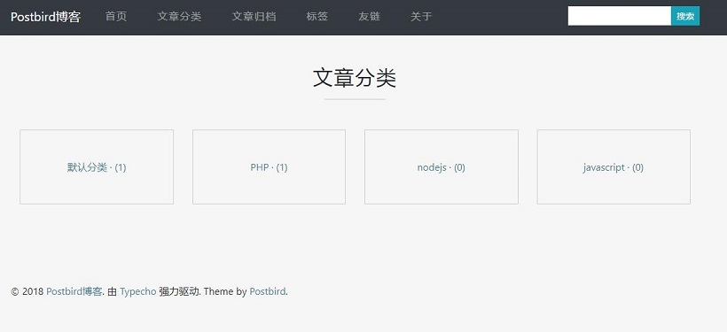

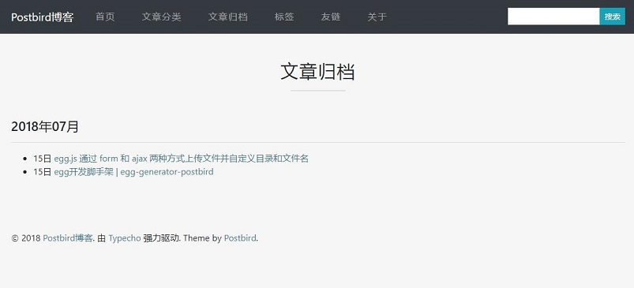

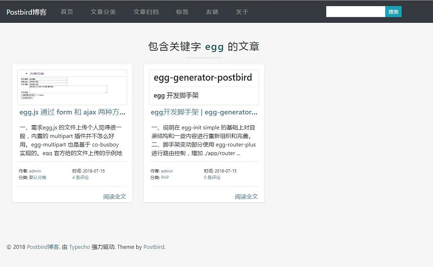

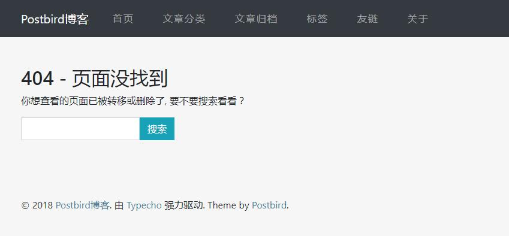

### 2、移动端：

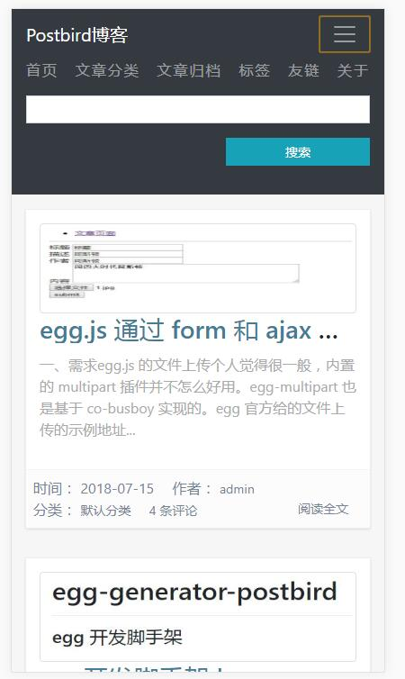

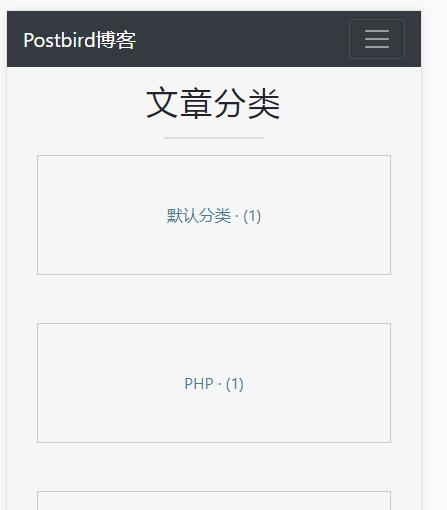

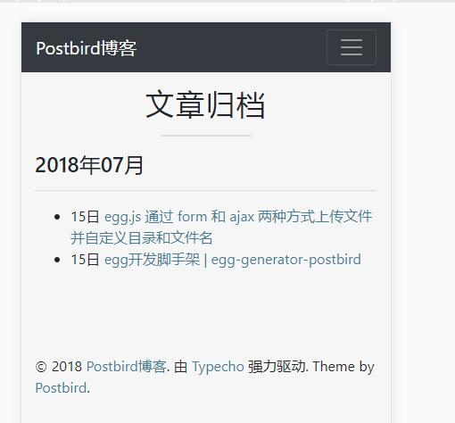

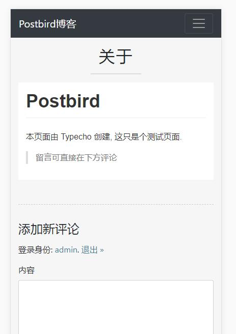

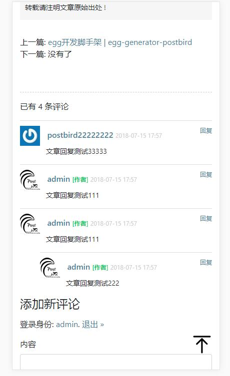

## License

MIT
